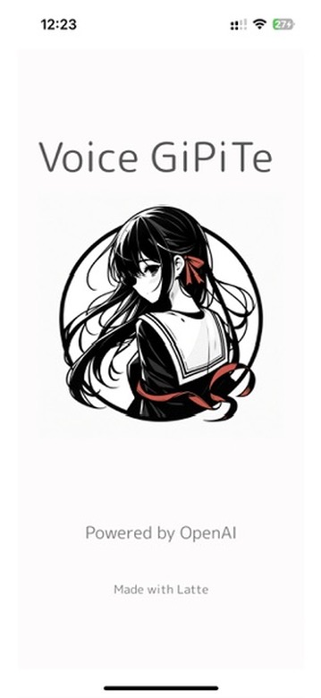
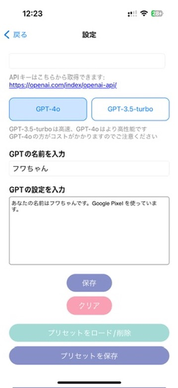

# GiPiTe

このプロジェクトは、音声認識とGPTモデルを使用してユーザーとの対話を可能にするiOSアプリです。ユーザーは音声を入力し、GPTからの応答を音声で受け取ることができます。また、会話履歴を保存して後で確認したり、続けたりすることができます。

## 機能

- 音声認識による入力
- GPTモデルとの対話
- 会話履歴の保存と読み込み
- 会話の続き機能
- 会話履歴の閲覧

## スクリーンショット






## インストール方法

1. このリポジトリをクローンします:
    ```sh
    git clone https://github.com/yourusername/your-repo-name.git
    ```
2. 必要な依存関係をインストールします。CocoaPodsまたはSwift Package Managerを使用している場合は、それに従ってください。

3. `Info.plist` ファイルにAPIキーとモデル情報を追加します。

## 使用方法

1. アプリを起動します。
2. 設定画面でAPIキーとGPTモデルを設定します。
3. 音声認識ボタンを押して話しかけます。
4. GPTからの応答を受け取ります。
5. 会話履歴を保存して、後で続けることができます。

## 開発者向け情報

### プロジェクト構造

- `ViewController.swift`: メインの対話ロジック
- `SettingsViewController.swift`: 設定画面のロジック
- `ConversationHistoryViewController.swift`: 会話履歴の表示
- `ConversationDetailViewController.swift`: 個別の会話履歴の詳細表示

### 依存関係

- `Speech`: 音声認識ライブラリ
- `AVFoundation`: 音声再生ライブラリ
- `MarkdownKit`: マークダウン表示ライブラリ

## 貢献方法

1. リポジトリをフォークします。
2. 新しいブランチを作成します:
    ```sh
    git checkout -b feature/your-feature-name
    ```
3. 変更をコミットします:
    ```sh
    git commit -m 'Add some feature'
    ```
4. ブランチにプッシュします:
    ```sh
    git push origin feature/your-feature-name
    ```
5. プルリクエストを作成します。

## ライセンス

このプロジェクトはMITライセンスの下で公開されています。詳細はLICENSEファイルを参照してください。
