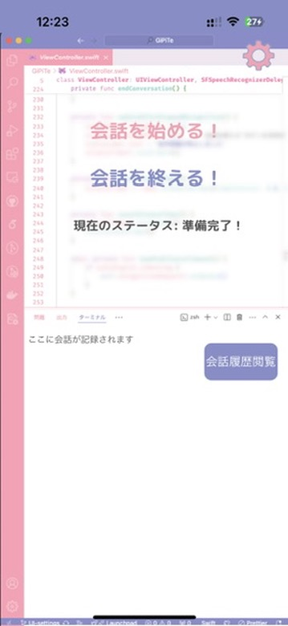

# GiPiTe

このプロジェクトは、音声認識とGPTモデルを使用してユーザーとの対話を可能にするiOSアプリです。ユーザーは音声を入力し、GPTからの応答を音声で受け取ることができます。また、会話履歴を保存して後で確認したり、続けたりすることができます。

## 機能

- 音声認識による入力
- GPTモデルとの対話
- 会話履歴の保存と読み込み
- 会話の続き機能
- 会話履歴の閲覧

## スクリーンショット





## インストール方法

1. このリポジトリをクローンします:
    ```sh
    git clone https://github.com/Latelatte/GiPiTe.git
    ```
2. 必要な依存関係をインストールします。CocoaPodsまたはSwift Package Managerを使用している場合は、それに従ってください。
3. Xcodeを使ってデバイスにビルドしてください。


## 使用方法

1. アプリを起動します。
2. 設定画面でAPIキーとGPTモデルを設定します。
3. 音声認識ボタンを押して話しかけます。
4. GPTからの応答を受け取ります。
5. 会話履歴を保存して、後で続けることができます。

## 開発者向け情報

### GCEの設定

SBV2をクローンする

```bash
git clone https://github.com/litagin02/Style-Bert-VITS2.git
cd Style-Bert-VITS2
```

サーバーの初期設定 主にPythonを入れる部分

```bash
sudo apt-get update
sudo apt-get install -y software-properties-common
sudo add-apt-repository ppa:deadsnakes/ppa
sudo apt-get update
sudo apt-get install -y python3.10 python3.10-venv python3.10-dev nginx
```

Pythonの優先順位を変更

最後にバージョンの確認

```bash
sudo update-alternatives --install /usr/bin/python3 python3 /usr/bin/python3.8 1
sudo update-alternatives --install /usr/bin/python3 python3 /usr/bin/python3.10 2
sudo update-alternatives --config python3
python3 -V
```

仮想環境の構築

```bash
python3.10 -m venv venv
source venv/bin/activate
```

必要なパッケージのインストール

初期化までついでに実行

```bash
pip install torch torchvision torchaudio --index-url https://download.pytorch.org/whl/cu118
pip install -r requirements.txt
python initialize.py
```

GCEでバゲットを使用できるように設定

```bash
curl -O https://dl.google.com/dl/cloudsdk/channels/rapid/downloads/google-cloud-sdk-400.0.0-linux-x86_64.tar.gz
tar -xf google-cloud-sdk-400.0.0-linux-x86_64.tar.gz
./google-cloud-sdk/install.shpytho
gcloud init
```

プロジェクトIDを訊かれるので、以下を入力

```bash
master-works-423913-n9
```

### 以下必要になるファイルをバゲットからVMに送信

```bash
gsutil cp gs://bert-models-latte/Dockerfile.deploy ~/Style-Bert-VITS2/ # Dockerfileをコピー
gsutil cp gs://bert-models-latte/default_config.yml ~/Style-Bert-VITS2/ # configファイルをコピー
gsutil cp -r gs://bert-models-latte/himari-v3 ~/Style-Bert-VITS2/model_assets/ # himariのモデルファイルをコピー
gsutil cp gs://bert-models-latte/server_editor.py ~/Style-Bert-VITS2/ # server_editorをコピー
gsutil cp gs://bert-models-latte/g2p_utils.py ~/Style-Bert-VITS2/style_bert_vits2/nlp/japanese/ # g2p_utilsをコピー
```

#### Dockerの設定 (現在使ってないから必要ないかも)

```bash
sudo apt-get update
sudo apt-get install -y apt-transport-https ca-certificates curl software-properties-common
curl -fsSL https://download.docker.com/linux/ubuntu/gpg | sudo apt-key add -
sudo apt-get install -y docker.io
sudo systemctl start docker
sudo systemctl enable docker
sudo systemctl status docker
sudo usermod -aG docker $USER
newgrp docker
source venv/bin/activate
```

##### Dockerのデプロイとコンテナの起動

```bash
docker build -t sbv2 -f Dockerfile.deploy .
docker run -d -p 8000:8000 sbv2
```

##### Dockerの使用状況とかの確認

```bash
docker ps -a
docker logs -f
```

ディスクスペースが無くなった際はこのコマンドでキャッシュを削除

```bash
docker system prune -a
```

### `Server_editor.py`を実行

```bash
cd Style-Bert-VITS2
source venv/bin/activate
nohup python server_editor.py --line_length 500 --line_count 10 > server.log 2>&1 &
```

サーバーを切断したいときは以下のコマンドでPIDを確認してタスクキル

```bash
ps aux | grep server_editor.py
```

## 貢献方法

1. リポジトリをフォークします。
2. 新しいブランチを作成します:
    ```sh
    git checkout -b feature/your-feature-name
    ```
3. 変更をコミットします:
    ```sh
    git commit -m 'Add some feature'
    ```
4. ブランチにプッシュします:
    ```sh
    git push origin feature/your-feature-name
    ```
5. プルリクエストを作成します。

### プロジェクト構造

- `ViewController.swift`: メインの対話ロジック
- `SettingsViewController.swift`: 設定画面のロジック
- `ConversationHistoryViewController.swift`: 会話履歴の表示
- `ConversationDetailViewController.swift`: 個別の会話履歴の詳細表示

## 依存関係

このプロジェクトは以下のオープンソースプロジェクトを使用しています：

- [Style-Bert-VITS2](https://github.com/litagin02/Style-Bert-VITS2) - GNU Affero General Public License v3.0
- [Speech](https://developer.apple.com/documentation/speech) - Appleのライセンス
- [Foundation](https://developer.apple.com/documentation/foundation) - Appleのライセンス
- [AVFoundation](https://developer.apple.com/documentation/avfoundation) - Appleのライセンス
- [MarkdownKit](https://github.com/bmoliveira/MarkdownKit) - MITライセンス
- [UIKit](https://developer.apple.com/documentation/uikit) - Appleのライセンス

## 使用しているAPI

このプロジェクトはOpenAIのAPIを使用しています。APIの使用は[OpenAIの利用規約](https://openai.com/terms)に準拠しています。

## 使用しているモデル

このプロジェクトでは、[VOICEVOX](https://voicevox.hiroshiba.jp/)の冥鳴ひまりモデルを使用しています。VOICEVOXエンジンの一部として提供される音声合成モデルを利用しています。

## 特定のモジュールのライセンス

このプロジェクトは `text/user_dict/` モジュールを使用しており、これは [GNU Lesser General Public License v3.0](LGPL_LICENSE) の下でライセンスされています。

## ライセンス

このプロジェクトは [GNU Affero General Public License v3.0](LICENSE) の下でライセンスされています。
